# 🚨 **EXECUTIVE EXTRACTION OVERHAUL PLAN**
**UK Business Directory SEO Lead Generation System**

## 📊 **CRITICAL SITUATION ANALYSIS**

### Current Performance (Unacceptable):
- ❌ **Executive Discovery:** 50% (4/8 URLs) - **NEEDS: >80%**
- ❌ **Contact Attribution:** 25% (1/4 executives) - **NEEDS: >70%**  
- ❌ **Email Discovery:** 12.5% (1/8 URLs) - **NEEDS: >60%**
- ❌ **Phone Discovery:** 12.5% (1/8 URLs) - **NEEDS: >50%**
- ❌ **LinkedIn Discovery:** 0% - **NEEDS: >40%**

### Business Impact:
- 🔥 **50% of potential leads completely missed**
- 🔥 **75% of found executives unusable (no contacts)**
- 🔥 **Zero professional verification capability**
- 🔥 **Cannot identify decision makers**

## 🎯 **LEVEL 4 REDESIGN ARCHITECTURE**

```mermaid
graph TD
    A["🌐 URL Input"] --> B["📄 Content Fetcher"]
    B --> C["🔍 Multi-Source Executive Discovery"]
    
    C --> D1["👥 Team Page Analysis"]
    C --> D2["📞 Contact Page Analysis"] 
    C --> D3["✍️ Signature Analysis"]
    C --> D4["📱 Social Media Analysis"]
    C --> D5["🏢 Companies House API"]
    
    D1 & D2 & D3 & D4 & D5 --> E["🧠 Executive Merger & Deduplication"]
    
    E --> F["📧 Advanced Contact Attribution"]
    F --> F1["Email Pattern Matching"]
    F --> F2["Signature Parsing"]
    F --> F3["Proximity Analysis"]
    F --> F4["Context Scoring"]
    
    F --> G["👔 Professional Context Analysis"]
    G --> G1["Title Extraction"]
    G --> G2["Seniority Classification"]
    G --> G3["Decision Maker ID"]
    
    G --> H["🔗 LinkedIn & Social Discovery"]
    H --> H1["LinkedIn Profile Search"]
    H --> H2["Social Media Discovery"]
    H --> H3["Professional Verification"]
    
    H --> I["✅ Quality Control Pipeline"]
    I --> I1["Name Validation"]
    I --> I2["Contact Verification"]
    I --> I3["Professional Validation"]
    I --> I4["Overall Quality Score"]
    
    I --> J["📊 Enhanced Executive Output"]
    
    style A fill:#ff6b6b,stroke:#ff5252,color:white
    style J fill:#4ecdc4,stroke:#26a69a,color:white
    style C fill:#ffe66d,stroke:#ffc107,color:black
    style F fill:#a8e6cf,stroke:#66bb6a,color:black
    style G fill:#dda0dd,stroke:#ba68c8,color:black
    style H fill:#87ceeb,stroke:#42a5f5,color:black
    style I fill:#ffa726,stroke:#ff9800,color:white
```



## 🔧 **5-PHASE IMPLEMENTATION STRATEGY**

### **Phase 1: Multi-Source Executive Discovery** 🔍
**Target:** Increase from 50% to 80%+ URL coverage

**Discovery Strategies:**
1. **Team/About Pages:** Parse dedicated team sections
2. **Contact Pages:** Extract contact-specific executives  
3. **Email Signatures:** Parse footer signatures for names
4. **Social Media Links:** Follow social links for executive info
5. **Companies House API:** Official director information

**Implementation:**
```python
class MultiSourceExecutiveDiscovery:
    async def discover_executives(self, url: str, content: str) -> List[Executive]:
        # 5 parallel discovery strategies
        strategies = [
            self.extract_from_team_pages,
            self.extract_from_contact_pages, 
            self.extract_from_signatures,
            self.extract_from_social_links,
            self.extract_from_companies_house
        ]
        
        results = await asyncio.gather(*[strategy(url, content) for strategy in strategies])
        return self.merge_and_deduplicate(results)
```

### **Phase 2: Advanced Contact Attribution** 📧
**Target:** Increase from 25% to 70%+ contact attribution

**Attribution Strategies:**
1. **Direct Patterns:** firstname@company.com, f.lastname@company.com
2. **Signature Analysis:** Parse email signatures for name-email pairs
3. **Proximity Scoring:** Names near contact information with confidence
4. **Context Analysis:** "Contact [Name] at [email]" patterns

**Implementation:**
```python
class AdvancedContactAttributor:
    def attribute_contacts(self, executives: List[Executive], content: str) -> List[Executive]:
        for executive in executives:
            # Multi-strategy contact attribution
            executive.email = self.find_email_with_confidence(executive.name, content)
            executive.phone = self.find_phone_with_confidence(executive.name, content)
            executive.attribution_confidence = self.calculate_confidence(executive)
        return executives
```

### **Phase 3: Professional Context Analysis** 👔
**Target:** 80%+ meaningful titles and roles

**Context Strategies:**
1. **Title Patterns:** CEO, Managing Director, Founder, Operations Manager
2. **Seniority Classification:** Tier 1 (CEO/MD), Tier 2 (Manager), Tier 3 (Staff)
3. **Decision Authority:** Budget authority and procurement influence
4. **Role Descriptions:** Detailed role context from content

### **Phase 4: LinkedIn & Social Discovery** 🔗
**Target:** 40%+ verified professional profiles

**Discovery Strategies:**
1. **LinkedIn Search:** Google site:linkedin.com searches
2. **Company Page Extraction:** LinkedIn company page executives
3. **Social Media Discovery:** Twitter, Facebook business profiles
4. **Profile Verification:** Validate profile matches

### **Phase 5: Quality Control Pipeline** ✅
**Target:** 75%+ overall quality score

**Validation Framework:**
1. **Name Authenticity:** UK name database validation
2. **Contact Verification:** Email/phone format validation
3. **Professional Verification:** LinkedIn profile validation
4. **Business Relevance:** Decision maker scoring

## 📋 **SUCCESS METRICS & VALIDATION**

### **Quantitative Targets:**
| Metric | Current | Target | Improvement |
|--------|---------|---------|-------------|
| Executive Discovery | 50% | >80% | +60% |
| Contact Attribution | 25% | >70% | +180% |
| Email Discovery | 12.5% | >60% | +380% |
| Phone Discovery | 12.5% | >50% | +300% |
| LinkedIn Discovery | 0% | >40% | +∞% |
| Quality Score | Unknown | >75% | Measurable |

### **Testing Framework (45+ URLs):**
1. **Baseline Test:** Current system measurement
2. **Component Testing:** Individual phase validation
3. **Integration Testing:** Full pipeline validation
4. **Performance Testing:** Speed and reliability
5. **Quality Assurance:** Manual verification sample
6. **Production Simulation:** Real-world scenarios

## 🎨 **CREATIVE PHASES**

### **Creative Phase 1: Multi-Strategy Discovery Algorithm**
**Challenge:** Adapt to diverse website structures and formats
**Innovation:** Self-learning content pattern recognition
**Approach:** 
- Analyze 45+ URL patterns for common structures
- Build adaptive parsing with fallback strategies
- Create confidence-weighted discovery scoring

### **Creative Phase 2: Intelligent Contact Attribution**
**Challenge:** Link contacts to individuals with high confidence
**Innovation:** Semantic proximity analysis with NLP
**Approach:**
- Develop context-aware attribution algorithms
- Create signature pattern recognition engine
- Build multi-factor confidence scoring

### **Creative Phase 3: Professional Profile Discovery**
**Challenge:** Find LinkedIn profiles without expensive APIs
**Innovation:** Intelligent search construction and validation
**Approach:**
- Design optimized search query algorithms
- Build result parsing and validation logic
- Create profile matching confidence system

## 🚀 **IMPLEMENTATION TIMELINE**

### **Week 1: Foundation**
- **Day 1-2:** Multi-Source Discovery Engine
- **Day 3-4:** Contact Attribution Engine
- **Day 5:** Integration Testing

### **Week 2: Enhancement**
- **Day 1-2:** Professional Context Analysis
- **Day 3-4:** LinkedIn & Social Discovery
- **Day 5:** Quality Control Pipeline

### **Week 3: Validation**
- **Day 1-3:** Large-scale testing (45+ URLs)
- **Day 4:** Performance optimization
- **Day 5:** Final validation and documentation

## 🎯 **EXPECTED OUTCOMES**

### **Business Impact:**
- ✅ **4x increase** in usable executive contacts
- ✅ **Professional verification** for lead quality
- ✅ **Decision maker identification** for targeting
- ✅ **Production-ready** lead generation system

### **Technical Achievements:**
- ✅ **Multi-source discovery** resilient to website variations
- ✅ **Intelligent attribution** with confidence scoring
- ✅ **Professional context** for business intelligence
- ✅ **Quality assurance** for data reliability

## 📊 **VALIDATION CRITERIA**

### **Acceptance Testing:**
1. **80%+ Executive Discovery Rate** on test URLs
2. **70%+ Contact Attribution Rate** for found executives
3. **Zero False Positives** in name extraction
4. **Measurable Quality Scores** for all executives
5. **Production Performance** under 5 seconds per URL

### **Quality Assurance:**
- Manual verification of 20% random sample
- LinkedIn profile validation for claimed profiles
- Email format and domain validation
- Business relevance scoring for decision makers

---

## ✅ **PLAN STATUS: READY FOR BUILD MODE**

**Critical Issues Addressed:**
1. ✅ Low executive discovery rate (50% → >80%)
2. ✅ Poor contact attribution (25% → >70%)
3. ✅ Missing professional context (0% → >80%)
4. ✅ No LinkedIn verification (0% → >40%)
5. ✅ Insufficient testing scale (8 → 45+ URLs)

**Ready for:** **BUILD MODE IMPLEMENTATION**
**Next Step:** Multi-Source Executive Discovery Engine Development

---
*Plan Created: June 19, 2025*  
*Urgency: CRITICAL - User Production Requirements*  
*Complexity: Level 4 - Complete System Redesign* 